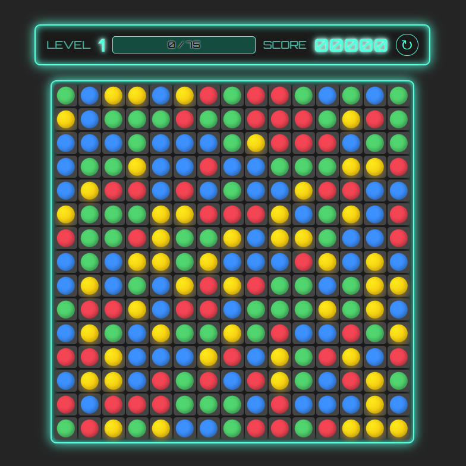

# Match-4

A simple web-based puzzle game that combines classic "Match-3" swapping mechanics with "Color Lines" matching rules (4 in a line). Built with React, TypeScript, Vite, and Framer Motion for smooth animations.




## Game Modes

- **Survival Mode:** A tactical, level-based challenge. Clear a target number of balls to advance to the next level. Reaching the target triggers **Fever Mode** — a fast-paced timed bonus round with a 2x score multiplier!
- **Endless Mode:** A continuous, cascade-focused experience. Empty spaces automatically refill with new balls dropping from the top. Difficulty naturally scales over time by introducing new colors into the mix. Play until the board is full and no valid moves remain!

## Gameplay Features

- **Cascading Combos:** Cleared balls trigger gravity and cascades, allowing for satisfying chain reactions with increasing score multipliers.
- **Any-Direction Matches:** Form lines horizontally, vertically, or diagonally (minimum 4 in a line).
- **Dual Leaderboards:** Separate High Score tracking for both Survival and Endless modes.
- **Automatic Hints:** If you sit idle for a few seconds, the game will automatically highlight a possible move.
- **Sleek UI:** A dynamic status bar keeps you updated on your level progress and score.
- **Smooth Animations:** Powered by `framer-motion` for a fluid, responsive, and tactile experience.

## Tech Stack

- [React 18](https://react.dev/)
- [TypeScript](https://www.typescriptlang.org/)
- [Vite](https://vitejs.dev/)
- [Framer Motion](https://www.framer.com/motion/)

## Getting Started

### Prerequisites

- Node.js (v16 or higher recommended)

### Installation

1. Clone the repository and navigate to the project folder:
   ```bash
   cd match-4
   ```
2. Install dependencies:
   ```bash
   npm install
   ```

### Running Locally

To start the development server, run:
```bash
npm run dev
```
Open `http://localhost:5173` in your browser to play the game.

### Building for Production

To create a production-ready build, run:
```bash
npm run build
```
The optimized files will be generated in the `dist` directory. You can preview the build using `npm run preview`.
