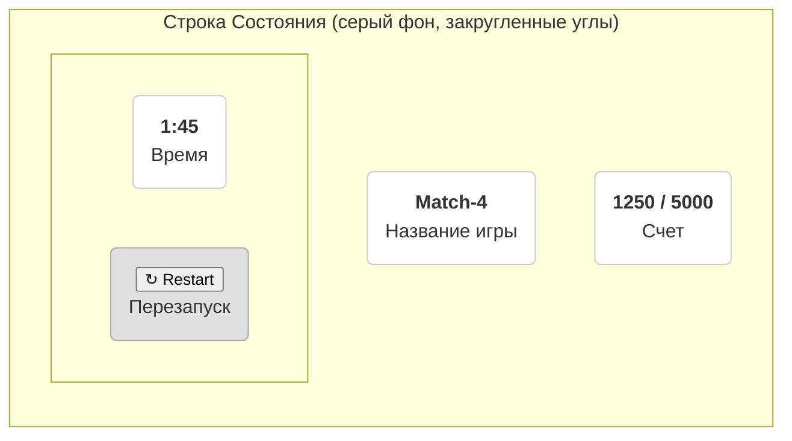

# UX Specification: Game Status Bar

**Version:** 1.0
**Date:** 2026-05-22
**Author:** Sally (UX Designer Agent)

## 1. Overview

This document specifies the design and behavior of the main status bar located above the game board. The status bar provides the player with essential real-time information about their current game session and includes a restart control. The design should match the existing aesthetic of the game board (greyish tones, rounded corners).

## 2. Conceptual Layout

The status bar is organized into three main logical groups, distributed horizontally to fill the container width (similar to `justify-content: space-between`).

- **Left Group:** Displays the name of the game.
- **Center Group:** Displays the player's current score and the score required to clear the level.
- **Right Group:** Displays the session timer and provides a restart button.

### Visual Wireframe

## 3. Component Specification

### 3.1. Main Container (`StatusBar`)

-   **Description:** The main wrapper for all status bar elements.
-   **Style:**
    -   `background-color`: A greyish tone, consistent with the game board's background.
    -   `border-radius`: Sufficiently rounded corners (e.g., `15px`).
    -   `padding`: Adequate internal padding (e.g., `10px 15px`).
    -   `display`: `flex`
    -   `justify-content`: `space-between`
    -   `align-items`: `center`
-   **Behavior:** Stays fixed at the top of the game area.

### 3.2. Game Title

-   **Description:** Displays the static title of the game.
-   **Content:** "Match-4"
-   **Style:**
    -   Font: Bold, easily readable.
    -   Color: High contrast against the background.

### 3.3. Score Display

-   **Description:** Shows the player's current score versus the target score.
-   **Content:** Dynamic, format: `{currentScore} / {targetScore}`.
-   **Style:**
    -   Numeric values should be prominent (larger font size, bold).
    -   A subtle label like "Score" can be placed below the numbers for clarity.
    -   Can be wrapped in its own rounded-corner container if it improves visual separation.

### 3.4. Timer

-   **Description:** Displays the elapsed or remaining time.
-   **Content:** Dynamic, format: `MM:SS`.
-   **Style:**
    -   Similar styling to the Score Display for consistency.
    -   May include a small clock icon for better visual recognition.
    -   A subtle label like "Time" can be placed below.

### 3.5. Restart Button

-   **Description:** A button that allows the player to restart the current level.
-   **Content:** A restart icon (e.g., `↻`) and/or the text "Restart".
-   **Style:**
    -   Clear visual affordance as a button (e.g., background color, border, shadow on hover).
    -   Should have rounded corners consistent with the overall theme.
    -   `cursor`: `pointer`.
-   **Behavior:**
    -   On click: Triggers the game restart logic.
    -   Should have a subtle hover/active state to provide feedback.

## 4. Next Steps

With this specification approved, the next step is to create a story for the development agent to implement these changes.
